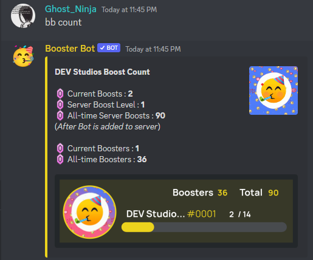

# Boost Count Command

The `bb count` command displays the total number of boosts for the server, as well as the server's current boost level.

**Usage:** `bb count`

**Example:**

**Note:** 
- Boosting a server on Discord gives that server extra features, such as increased upload limit and emojis.
- The boost level indicates the number of boosts the server has. Each server starts at level 1, and can level up by gaining more boosts. 
- The Boost Count can only be run by server administrator/Moderator

